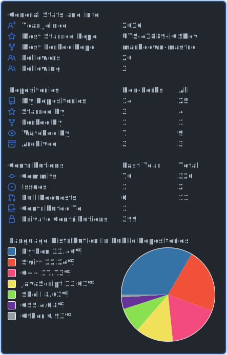

Engineer and product builder working across Linux systems, embedded hardware, and developer tools.

## Current work

- [uConsole Linux](https://github.com/blue-1ms/uconsole-sway) — Ubuntu/Sway configuration and reproducible Arch Linux ARM tooling for the ClockworkPi uConsole CM4 Lite.
- [shairport-sync-tui](https://github.com/blue-1ms/shairport-sync-tui) — A responsive terminal dashboard for Shairport Sync AirPlay receivers.
- [grounded-ui](https://github.com/blue-1ms/grounded-ui) — A Codex skill for product interfaces designed around real work.

## GitHub activity

## Elsewhere

[Personal site](https://bluexguardian.com/) · [Studio](https://gengartech.com/) · [LinkedIn](https://linkedin.com/in/oscar-tian) · [Email](mailto:mew@mewhouse.com.au)
